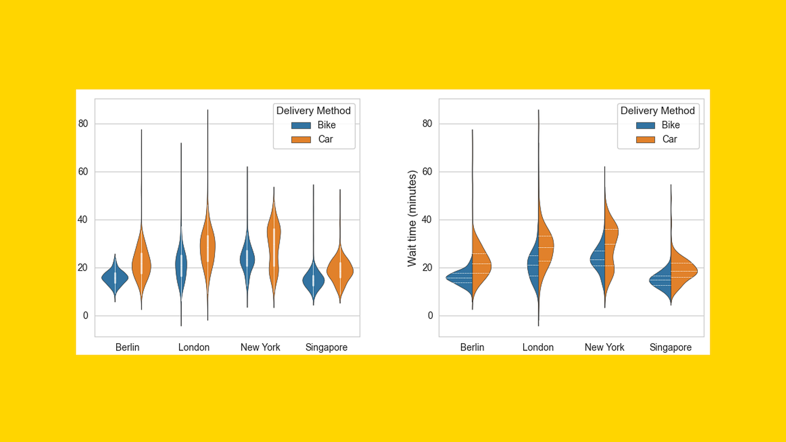
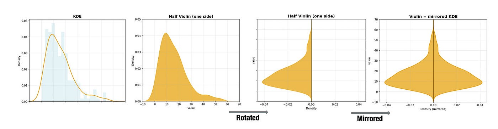
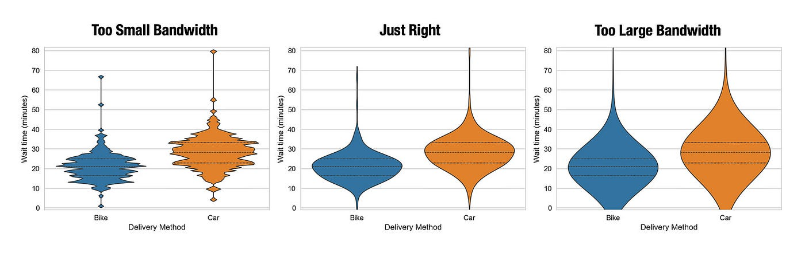
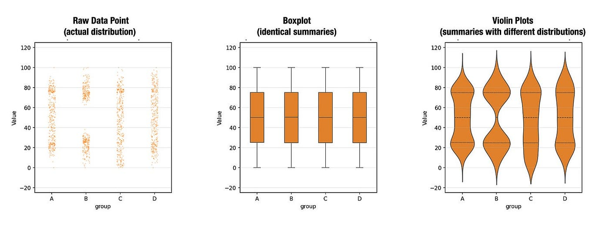
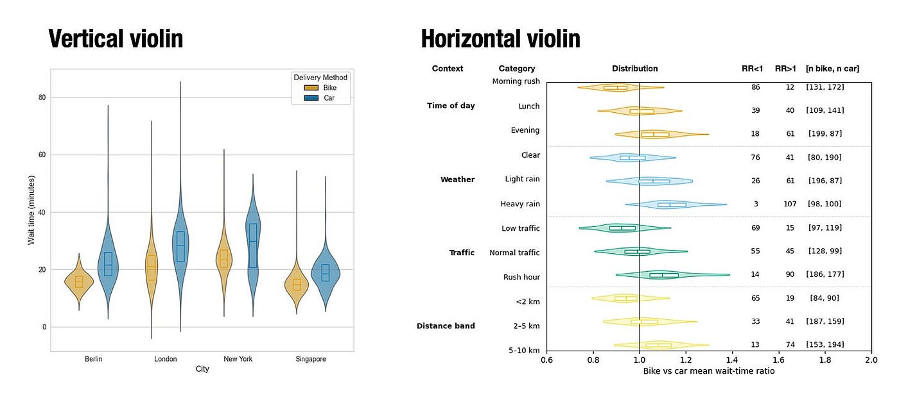
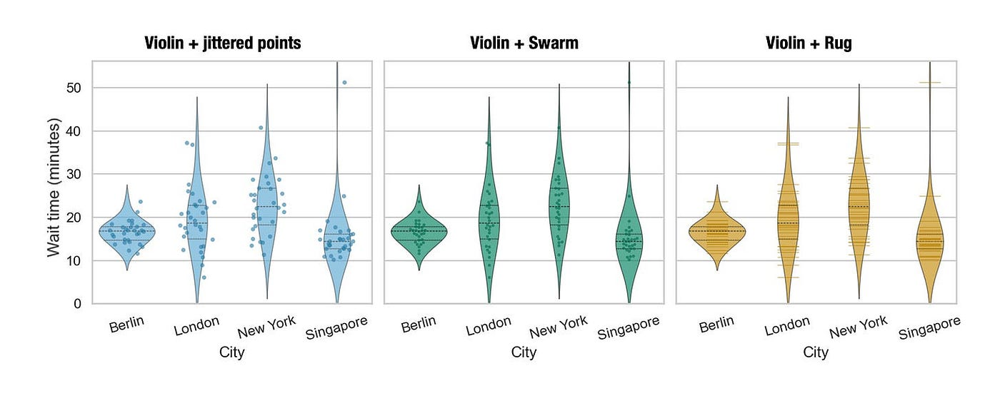
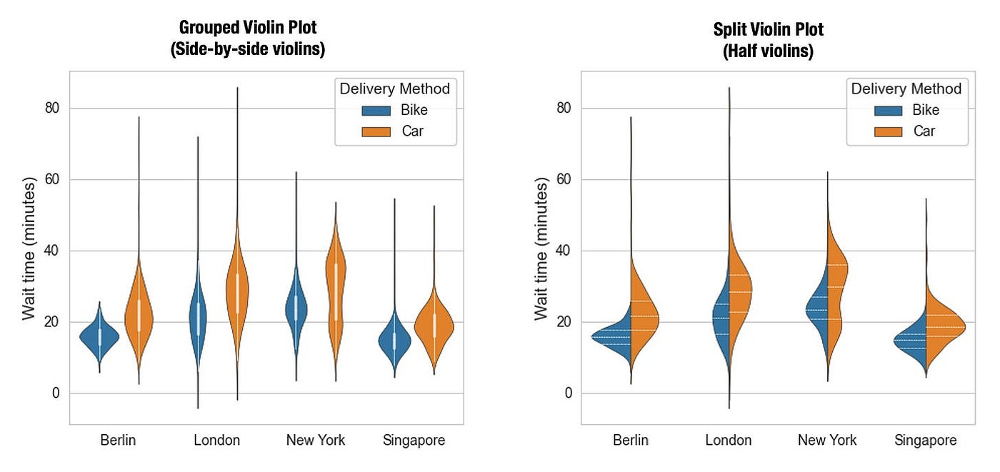
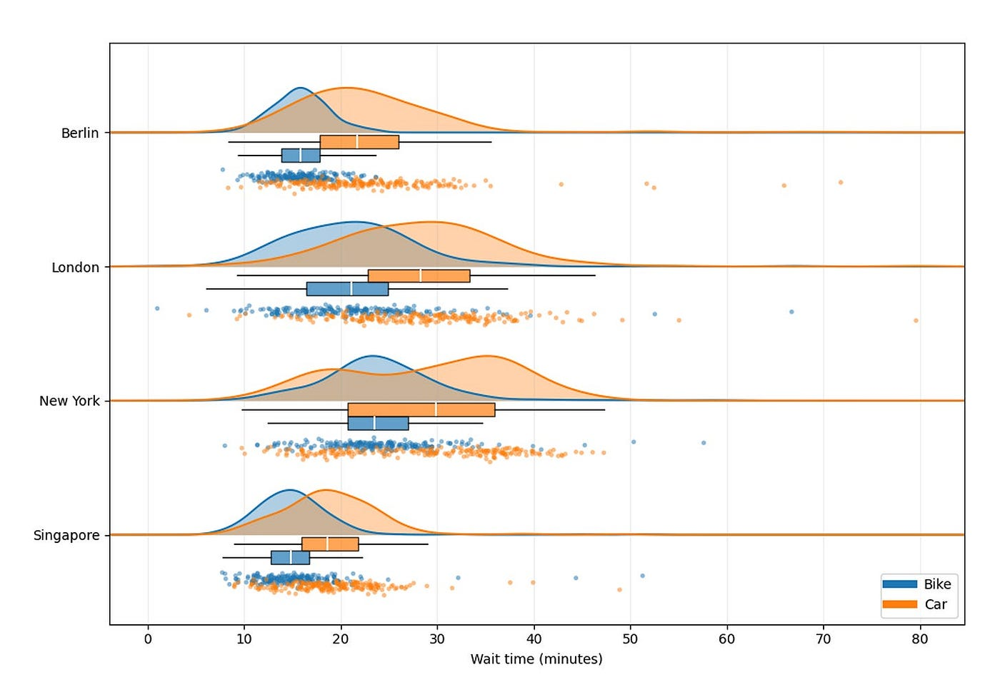

# What Violin Plots Tell You That Boxplots Hide

Imagine you're looking at delivery wait times for bike couriers in three cities.

A boxplot tells you the median and the interquartile range (IQR).

It doesn't tell you whether the data are skewed, long-tailed, or quietly bimodal.

A violin plot can.

A violin is essentially a boxplot plus a smoothed distribution, so you can see:

- Where values cluster
- Where gaps appear
- Whether there are one or multiple peaks

That's the point of a violin: **shape + summary in one view**.

If you're using tools like Lumiplot or LLMs to help you plot, you want your intent to be precise. A prompt like this works well:

> Create a **[vertical / horizontal]** **[single / grouped / split]** violin plot of **[value variable]** by **[category variable]**, with **[no overlay / inner boxplot / quartile lines only / jittered points / beeswarm / rug / full raincloud]**, using **[library: seaborn / matplotlib / plotly / …]**.

---

## 1. What is a violin plot?

At a high level:

> **violin = boxplot + kernel density estimate (KDE)**

Instead of showing only a few numbers (median, quartiles, whiskers), a violin shows an **estimated probability density**. It's wide where many values occur and narrow where data are sparse. Inside the "violin," you can optionally draw familiar boxplot elements like the median and quartiles.

### 1.1 Under the hood (light KDE intuition)

To build a violin plot, you:

1. Estimate the distribution of the data along the value axis using a KDE.
2. Turn that 1D density curve sideways so density runs horizontally and values stay vertical.
3. Mirror the curve around a central spine to form a symmetric "violin."

The width of the violin at any height is proportional to the estimated density at that value.

Most libraries also:

- Rescale the density (so all violins share the same max width or area)
- Clip very long tails
- Offer options for drawing a median marker, IQR box, or raw points on top

Implementations differ (kernel choice, bandwidth, rescaling rule), so silhouettes and relative widths can vary between tools. The key idea is simple:

- **Too small bandwidth →** spiky violin that overfits noise
- **Too large bandwidth →** smooth blob that hides real structure

Most plotting libraries choose a default bandwidth, but remember:

**the violin is an estimate, not the raw data.**

---

## 2. How to read a violin plot

Think of a violin as a **density plot with optional boxplot hints**, not a fat bar.

### 2.1 Mapping from boxplots

Most implementations either:

- Draw a small boxplot inside the violin, or
- Draw horizontal lines across the width at the quartiles

Typically:

- A horizontal line or dot marks the **median**
- Inner lines or a box show the **central 50% (IQR)**
- The overall silhouette shows **how values are distributed** around that center

If you're used to boxplots, add one extra rule:

> At any given y-value, **width ≈ how common those values are** (the estimated density there).

### 2.2 Shape = density

A violin is just a KDE turned sideways and mirrored:

- **Wide regions →** many values (high density)
- **Thin regions →** few values (low density)
- **Pinched waists →** gaps in the data
- **Multiple bulges →** multiple modes

Back to bike wait times:

- A tall violin with a fat base might mean many short waits plus a few very long ones.
- Two bulges could reflect rush-hour vs off-peak deliveries.

One important caveat: width is **normalized density**, not raw counts. Two violins can have similar widths even if one is based on far more observations than the other.

---

## 3. When to use violin plots (and when to avoid them)

In many datasets, the underlying distribution can change dramatically while the boxplots remain identical. You can see this clearly whenever you overlay the "raw" points: clusters appear or vanish, yet the boxes barely move.

Violin plots are a good way to show the distribution with more detail than a traditional boxplot. But it's still your job to make sure the KDE and overlays **don't hide important structure**.

In short, violins shine when you have **enough data** and you care about **distribution shape**, not just medians.

### 3.1 When a violin plot is a good idea

**1. Medium to large samples with structure**

As a rough rule, aim for **≈30+ points per group** before trusting a KDE; **50–100+** is safer.

With hundreds of bike orders per city, violins can reveal:

- Skew
- Long tails
- Multimodal patterns

You're no longer guessing whether a wide box means "noisy" or "actually two clusters."

**2. When the full distribution matters**

Use violins when your questions sound like:

- "Are waits in City A more skewed than in City B?"
- "Does one city have a long tail of very slow deliveries?"
- "Do we have distinct subpopulations (e.g. lunch rush vs late night)?"

A boxplot can't distinguish "bimodal" from "wide."

A violin can.

**3. Comparing several groups at once**

Side-by-side violins scale well when you have multiple categories:

- Wait times by city
- Weekday vs weekend
- Time of day (morning / lunch / evening)

Horizontal violins help when you have many groups or long labels and want to scan top-to-bottom.

### 3.2 When to avoid violin plots

**1. Very small samples**

With **< ~30 points per group**, KDEs are unstable:

- A handful of points can create misleading bumps.
- Smoothing can invent "structure" between widely spaced values.

If you only have 8 orders from a pilot city, a violin will look authoritative but isn't.

Use a **strip plot, beeswarm, or boxplot + points** instead.

**2. Clearly discrete / few-level data**

For a 1–5 rating scale or small integer counts:

- A violin suggests values like 2.7 or 3.4 that don't actually exist.
- You get a misleading sense of continuity.

Use **bar charts or dot plots** when the underlying variable is clearly discrete.

**3. Outlier-centric questions**

Violins don't explicitly mark outliers; they just stretch the tails.

If your question is "Where are the scary extremes?", then either:

- Overlay the **raw points**, or
- Use a **boxplot with explicit outlier markers**

---

## 4. Variations: orientation, overlays, grouping, and rainclouds

This is where style choices really matter. Violins are flexible — which also means it's easy to overdo them.

### 4.1 Orientation: vertical vs horizontal

**Vertical violins**

- Categories on the x-axis, values on the y-axis
- Good for ~3–10 categories with short labels
- Works well in wide layouts (slides, dashboards)

Avoid when labels are long or you have many groups.

**Horizontal violins**

- Categories on the y-axis, values on the x-axis
- Great for many groups or long names
- Easy to sort and scan top-to-bottom

Avoid when you only have a few short labels and a vertical plot is already clear.

### 4.2 Overlays: boxplot, jitter, beeswarm, rug

#### Violin + boxplot (or quartile lines)

The violin shows density; a slim boxplot or quartile lines show median and IQR.

**Use when:**

- Your audience expects familiar summary stats
- *n* per group is moderate to large (≈50+)
- You want a clean, publication-style graphic

**Avoid when:**

- *n* is tiny and boxplots themselves are unstable

#### Violin + jittered points

Each point is slightly offset so points don't sit on top of each other.

**Use when:**

- Data are mostly continuous
- You want a quick check that the KDE roughly matches the data

#### Violin + beeswarm (swarm)

Points are packed so they don't overlap, forming little columns at repeated values.

**Use when:**

- You want every observation visible
- Discrete or rounded values matter (e.g., times rounded to minutes)

**Avoid when:**

- *n* is large; the swarm becomes wide and noisy
- The plotting area is narrow and can't afford lateral spread

#### Violin + rug

Thin ticks show individual data values along the axis.

**Use when:**

- *n* ≈ 100–1000 per group
- You want a subtle reminder that the density comes from real points
- You need to keep the plot visually clean

**Avoid when:**

- You need to highlight specific outliers (ticks are easy to miss)
- The figure is already busy; rugs become visual noise

### 4.3 Grouped vs split violins

#### Grouped violins (side-by-side)

Multiple narrow violins per main category (e.g., bike vs car within each city).

**Use when:**

- You have 2–4 subgroups per category
- You want to compare within and between categories in one view
- Each subgroup needs its own full shape

#### Split violins (two halves)

One violin per category, split into left/right halves for two subgroups.

**Use when:**

- You have exactly two subgroups (A vs B, before vs after)
- You want direct head-to-head comparison inside each category
- Space is limited and grouped violins would be too wide

**Avoid when:**

- There are more than two subgroups
- Your audience is unfamiliar with split violins and might misread them

### 4.4 Raincloud plots

A raincloud combines:

- A half-violin (density)
- A boxplot or summary marker
- Jittered raw points underneath

**Use when:**

- You want maximum transparency: density + summary + raw data
- *n* per group is small to medium (≈10–300)
- You're doing exploratory analysis or scientific reporting and want to show how the smooth shape lines up with real observations

**Avoid when:**

- You have many categories; stacked rainclouds get chaotic
- The figure must be very small — details will disappear and the plot will feel crowded
- Your audience is non-technical and already overwhelmed — sometimes a simple boxplot or basic violin is easier to explain and defend

---

## 5. Takeaways (and how Lumiplot helps)

Violin plots shine when you care about **how values are distributed**, not just where the median sits.

- Small *n* or discrete scores → stick to **points and boxplots**
- Big *n* and messy distributions → let the **violins (or rainclouds) play**

If you:

- Read width as **density**,
- Respect **sample size**, and
- Choose overlays that match your **data and audience**,

violins become one of the cleanest ways to show the real shape of your distributions — without hiding behind a single box.

### 5.1 How to use Lumiplot to create a violin plot

In Lumiplot, creating a violin plot is straightforward:

1. Select **"Violin plot"** as the plot type.
2. Choose your **x (category)**, **y (value)**, and optional **group** variable.
3. Add your display style:
   - plain violin
   - violin + box
   - jittered points
   - beeswarm
4. Run it and let Lumiplot handle the KDE settings, layering, and styling for you.

You focus on the question —

**"What shape should these waits have?"**

Lumiplot focuses on drawing the violin that actually answers it.

Try Lumiplot today at [Lumiplot.ai](https://lumiplot.ai/)

