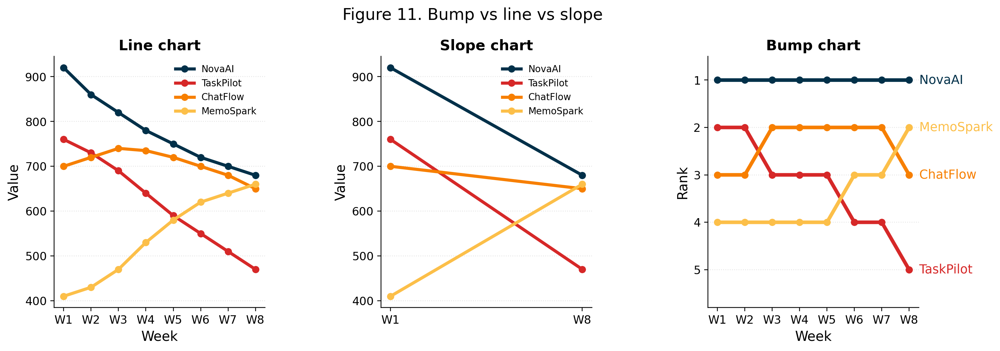

# Bump Charts: When Rank Changes Matter More Than Values

A bump chart shows how rankings change over time. Each line traces one entity's rank across periods — crossings show overtakes, flat lines show stability. Unlike line charts of raw values, bump charts focus on *who's ahead* and *when order changes*.



---

## Focus

- What a bump chart is and when it shines
- When to skip or qualify a bump chart (magnitude matters, ties, missing data)
- Data prep: ranking, tie-breaking, missing-period handling
- Design choices: direct labels vs legends, highlights, small multiples
- Best-practice reference figure

---

## Code in this repo

- `bump_chart_demo_v3.py` — generates 21 figures covering definition, interpretation, caveats, and design
- Synthetic app-downloads data (embedded in script)
- All figures exported to `images/`

---

## Repository structure

- `scripts/` – Python script to generate figures
  - `bump_chart_demo_v3.py`
- `images/` – Generated figure images (PNG files)
- `README.md` – This file

To run the script:

```bash
cd bump_plot/scripts
python bump_chart_demo_v3.py
```

Figures are written to `../images/`.
